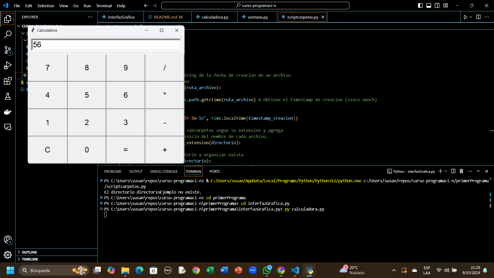

#Interfaz gráfica Tkinter

En el prensente directorio se utilizó el modulo Tkinter para crear una interfaz gráfica para una calculadora.

Tkinter es una biblioteca estandar utilizada para crear una interfaz gráfica de usuario.

Propietario: Susan Cedeño.

##Instrucciones de uso

¿Que hay que tener instalado para ejecutar el programa?¿Que comando utilizar?

py calculadora.py

S

#Demostración de ejecución

  

